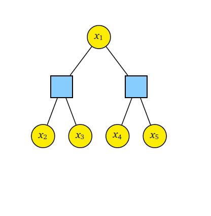
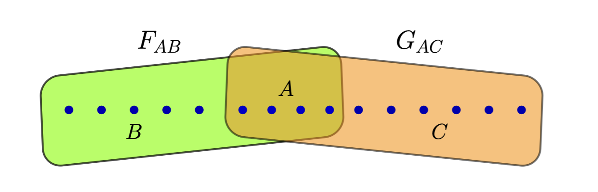
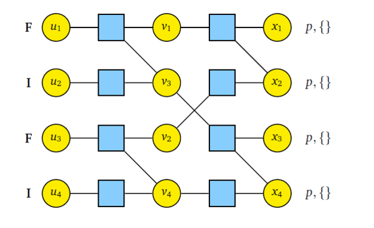

 Belief Propagation with Quantum Messages on CQ Channels

Belief propagation (BP) is a classical algorithm that approximates the marginal distribution associated with a factor graph by passing messages between adjacent nodes.  
In 2016, Renes developed belief propagation with quantum messages <a href="https://iopscience.iop.org/article/10.1088/1367-2630/aa7c78/pdf">(BPQM) </a> and described how it could be used to decode classical codes defined by tree factor graphs that are sent over the classical-quantum pure-state channel. 

  

In this research, we extend the classical belief propagation algorithm to a method called Paired Measurement Belief Propagation with Quantum Messages (PM-BPQM) for binary symmetric classical-quantum (BSCQ) channels. A tree factor graph based classical code can be analyzed using two channel combining operations- check-node and bit-node combining. We obtained sufficient statistics based on classical parameters for channel combining operations (check-node and bit-node combining) for quantum states from CQ channel outputs via PM-BPQM. Using these classical parameters and monte carlo based density evolution, we characterized the asymptotic performance (e.g. finding noise thresholds) of tree based codes (regular low-denisty parity-check (LDPC), polar codes) over BSCQ channels.
  We deveoped PM-BPQM based polar decoder over BSCQ channels and provided its performance.
 

  

  Here are the list of papers which gives more insight on this topic
1. Belief propagation with quantum messages for symmetric classical-quantum channels, <a href="https://ieeexplore.ieee.org/abstract/document/9965841"> ITW 2022</a> <a href="https://arxiv.org/abs/2207.04984"> (arxiv version)</a>  
2. Belief-propagation with quantum messages for polar codes on classical-quantum channels, <a href="https://ieeexplore.ieee.org/abstract/document/10206723"> ISIT 2023 </a>  
3. Polar Codes for CQ Channels: Decoding via Belief-Propagation with Quantum Messages <a href="https://arxiv.org/pdf/2401.07167"> (arxiv preprint) </a>. 

  Here are the relevant repositories 
1. Finding thresholds for regular LDPC codes over BSCQ channels - <a href="https://github.com/Aviemathelec1995/PMBPQM_BSCQ"> PMBPQM_BSCQ </a>
2. Simulating Polar Decoder over BSCQ channels - <a href="https://github.com/Aviemathelec1995/CQ-Polar-BPQM"> CQ-Polar-BPQM </a>.

 Reed--Muller Codes on CQ Channels

Reed-Muller (RM) codes has gained considerable amount interest in theoretical computer science and coding theory community since its discovery in 1954.  
In 2016, Kudekar et al. showed that RM codes achieve capacity on binary erausure channels (BEC)<a href="https://arxiv.org/pdf/1601.04689">.</a> Later, this result was extended by Reeves and Pfister in 2021, where they showed RM codes achieve vanishing bit error rate for binary memoryless symmetric (BMS) channels  for all rates below capacity. This was further extened in 2023 by Abbe and Sandon who showed block error probability also vanishes for BMS channels. 

  

In this work, we consider RM codes on binary-input symmetric classical-quantum (BSCQ) channels. We develop the notion of mean squared error (MSE) in the context of quantum binary hypothesis testing. By choosing MSE minimizing quantum observables, we define the minimum mean-squared error (MMSE). Using the transitive symmetry we obtain correlation inequality lemma between observables. Using this we establish a recursive relation of MMSEs between longer and shorter RM codes via nesting structure and double transitivity. 
Our results show that any set of any subpolynomial (but super-polylogarithmic) number of bits can be decoded
    with high probability when the code rate is less than the Holevo capacity.
 

  

The published version of this work can be found here- Reed--Muller Codes on CQ Channels via a New Correlation Bound for Quantum Observables <a href="https://ieeexplore.ieee.org/document/11195211"> ISIT 2025 </a><a href="https://arxiv.org/abs/2502.03785"> (arxiv version)</a>.

 Quantum State Compression with Polar Codes

In Quantum State Compression poblem, Alice wants to transmit her quantum states to Bob using the least number of qubits possible. 
In 1995, Schumacher proposed the first method for rate-optimal lossless quantum state compression and it can be seen as a generalization of Shannon’s original protocol for rate-optimal lossless classical compression. However, direct implementation on a quantum computer is quite complex. 

  

The idea of syndrome source coding was first introduced in 1976 by Ancheta which provides an approach to use linear codes for classical compression problems.The complexity of syndrome source coding can be reduced if linear codes used for the compression have low encoding and decoding complexity. Polar codes are also known to be rate-optimal for lossless compression problems. 
In this work, we develop a belief propagation (BP) based low complexity quantum state compressor and decompressor using polar codes. For quantum state decompressor, we treat frozen bits of polar codes as syndrome qubits and information bits are kept as ancilla. Using BP we construct conditional unitary which determines the state of information qubits coherently. Thus we get coherent version of polar source coding protocol based on BP. The quantum state compressor follows the same principle as the decompressor. 

  

The published version of this work can be found here- Quantum State Compression with Polar Codes <a href="https://ieeexplore.ieee.org/document/10619556"> ISIT 2024 </a>.

The code repository can be found here - <a href="https://github.com/Aviemathelec1995/QSCpolar"> QSCPolar</a>.
