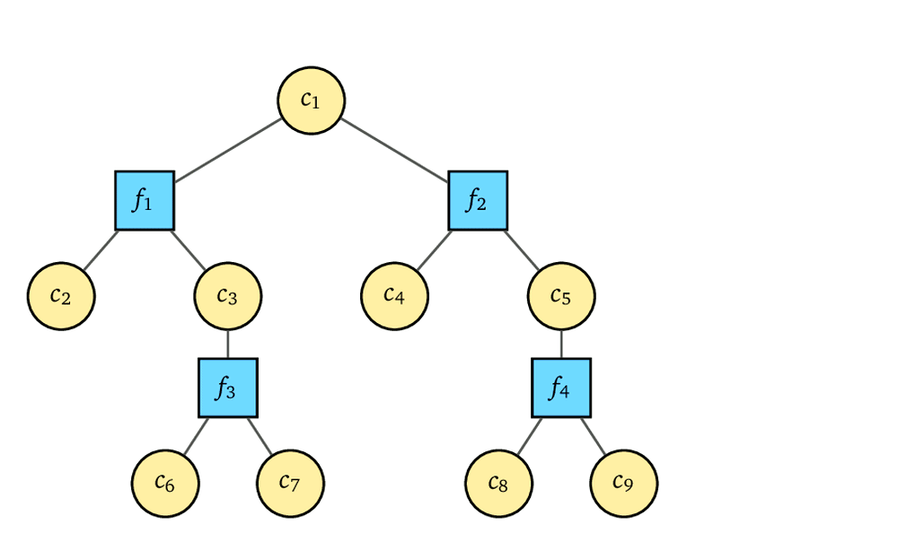
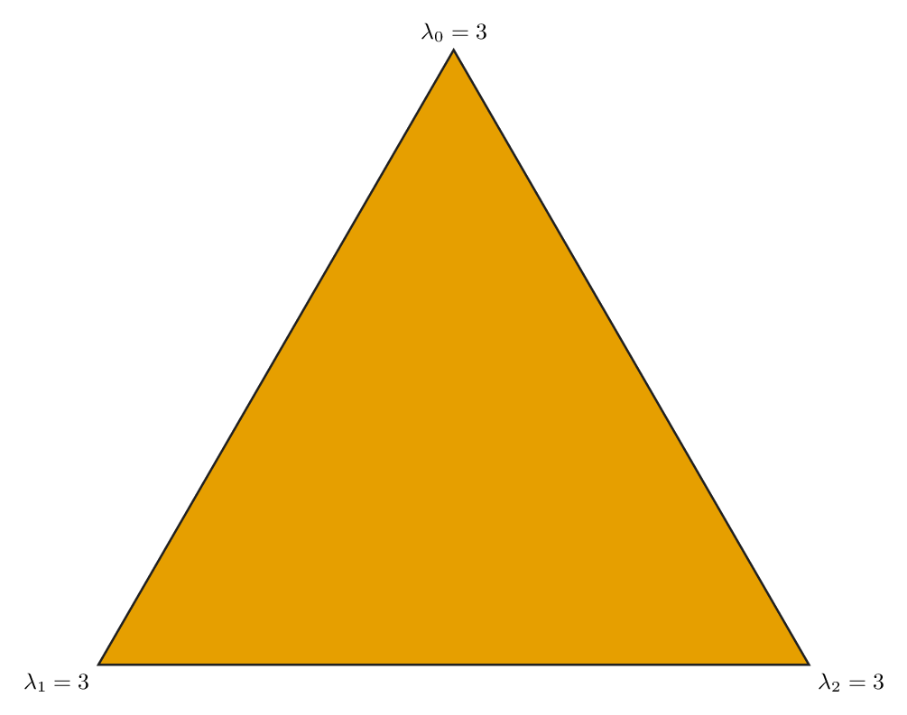
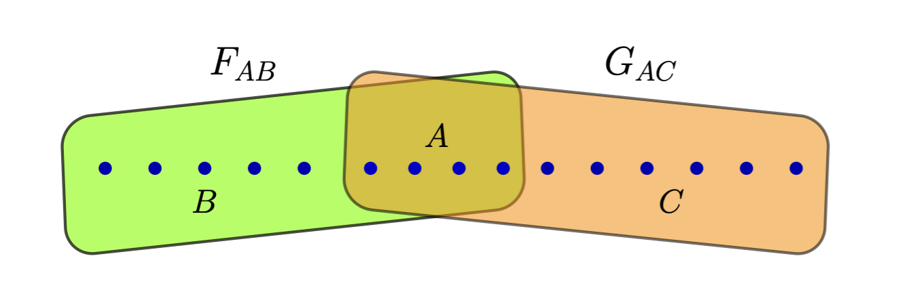
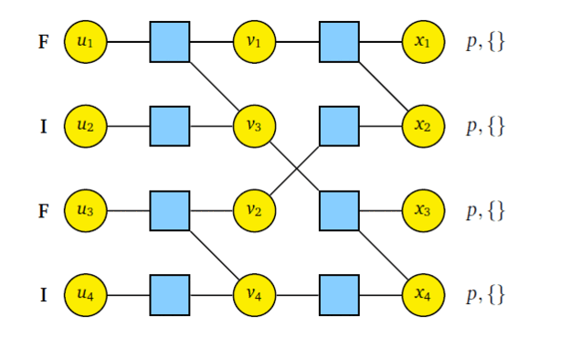

 Quantum Message Passing

<h3 style="clear: both; margin: 26px 0 10px;">History</h3>

<a href="https://cdn.aaai.org/AAAI/1982/AAAI82-032.pdf">Belief propagation (BP) was introduced by Pearl in 1982</a> as an efficient algorithm for computing marginal distributions on tree-structured graphical models. For linear codes, BP works by passing messages between neighboring nodes of a factor graph, which represents the variables and local constraints. <a href="https://ieeexplore.ieee.org/document/1057683">Gallager’s iterative low-density parity-check (LDPC) decoding</a> and <a href="https://ieeexplore.ieee.org/document/397441">turbo decoding</a> can be described as special cases of this.

A classical–quantum (CQ) channel takes a classical input and outputs a quantum state. A pure-state channel (PSC) is a CQ channel whose output states are pure quantum states. <a href="https://ieeexplore.ieee.org/document/651037">Holevo</a>, <a href="https://journals.aps.org/pra/abstract/10.1103/PhysRevA.56.131">Schumacher, and Westmoreland</a> identified the maximum rate of classical information transfer over a CQ channel, but attaining this rate generally requires a collective measurement of the full output block. Such measurements are difficult to implement, especially for codes defined by large factor graphs. Thus, a key question is whether BP can be generalized to efficiently decode codes transmitted over CQ channels.

Deep-space optical communication is a motivating application. When the received mean photon number per pulse is less than one, <a href="https://doi.org/10.1103/PhysRevA.58.146">joint quantum measurements over long code blocks can provide a significant capacity gain</a> compared with pulse-by-pulse measurements. <a href="https://doi.org/10.1103/PhysRevLett.106.240502">Structured optical receivers</a> were proposed to realize this advantage, and <a href="https://arxiv.org/abs/1202.0533">CQ polar coding</a> showed that the Holevo capacity of a pure-loss optical channel is achievable. However, efficient decoding and code constructions were not known.

<a href="https://doi.org/10.1088/1367-2630/aa7c78">Belief propagation with quantum messages (BPQM)</a> was introduced as a quantum analogue of classical BP for decoding classical linear codes with tree factor graphs over binary-input pure-state CQ channels, where directly implementing the optimal collective measurement becomes infeasible for large code blocks. <a href="https://doi.org/10.22331/q-2022-08-23-784">Later it was proved</a> that BPQM minimizes both the probability of decoding one bit incorrectly and the probability of decoding the full block incorrectly for binary linear codes with tree factor graphs on a PSC. The decoding complexity was also reduced from exponential to quadratic.

Our works extend BPQM and develop rigorous tools for the analysis and design of efficient quantum message-passing algorithms. The main contributions are summarized below.
<h3 style="clear: both; margin: 26px 0 10px;">Quantum Message Passing for Binary CQ Channels</h3>

Density evolution (DE) analyzes the behavior of BP decoding as the code length grows. It tracks the distribution of messages passed along the edges of a factor graph and finds the noise threshold, the largest channel-noise level for which the decoding error approaches zero. <a href="https://arxiv.org/abs/2207.04984">Our work</a> generalized DE equations for BPQM over binary-input symmetric CQ channels and used them to compute noise thresholds for regular LDPC codes. We then used DE to <a href="https://arxiv.org/abs/2401.07167">design polar codes for BPQM decoding</a>, determine their achievable rates, and validate the analysis through decoder simulations.

<h3 style="clear: both; margin: 26px 0 10px;">Quantum Message Passing on Channels with Larger Input Alphabets</h3>

Prior BPQM constructions and density-evolution analyses focused mainly on binary alphabets. We <a href="https://arxiv.org/abs/2601.21330">generalize</a> BPQM to symmetric q-ary PSCs whose output states follow circular symmetry. For this class of channels, check-node and bit-node combining can be tracked efficiently through closed-form recursions on the Gram-matrix eigenvalues, independently of the physical realization of the output states. These recursions yield explicit BPQM operations and a DE framework for estimating LDPC decoding thresholds and constructing polar codes for a target block-error rate. 
  
Our <a href="https://arxiv.org/abs/2607.14247">work on finite abelian groups</a> considers collections of quantum states in which each state is indexed by an element of a finite abelian group, forming a group-covariant PSC. Due to the group symmetry, the channel can be characterized by the eigenvalues of its Gram matrix, with each eigenvalue indexed by a group character. Based on this representation, we develop quantum message-passing update rules for a general class of factors. These local rules preserve the class of group-covariant quantum messages and provide a message-passing framework for tree factor graphs. For coding theoretic applications, this framework applies to polar codes, LDPC codes, and convolutional and turbo codes defined on abelian groups. It recovers the q-ary formulation when the group is the integers modulo q and extends BPQM to non-cyclic alphabets and more general factor-graph constraints.

<h3 style="clear: both; margin: 26px 0 10px;">Double Exponential Convergence of BPQM Error Rate</h3>

For computation trees with variable-node degree at least three, we <a href="https://arxiv.org/abs/2609.05857">proved double-exponential convergence</a>. Below the BPQM density-evolution threshold, the symbol-error probability under BPQM decays double exponentially with the number of decoding rounds. This result is also important because it provides a finite-length sufficient criterion for convergence of the symbol-error probability under density evolution.

We <a href="https://arxiv.org/abs/2609.05857">developed a decoder for random q-ary LDPC codes</a> that applies BPQM to symbols whose local computation neighborhoods are trees, treats symbols whose neighborhoods contain cycles as erasures, and recovers those erased symbols by Gaussian elimination. For channels below the BPQM threshold, the block-error probability of this decoder vanishes as the blocklength tends to infinity. This shows that BPQM decoding works for random LDPC codes even when their Tanner graphs contain cycles.

<h3 style="clear: both; margin: 26px 0 10px;">Papers</h3>
1. Belief Propagation with Quantum Messages for Symmetric Classical-Quantum Channels, <a href="https://ieeexplore.ieee.org/document/9965841">ITW 2022</a> <a href="https://arxiv.org/abs/2207.04984">(arXiv)</a> 
2. Belief-Propagation with Quantum Messages for Polar Codes on Classical-Quantum Channels, <a href="https://ieeexplore.ieee.org/document/10206723">ISIT 2023</a> 
3. Polar Codes for CQ Channels: Decoding via Belief-Propagation with Quantum Messages, <a href="https://arxiv.org/abs/2401.07167">(arXiv)</a> 
4. Belief Propagation with Quantum Messages for Symmetric Q-ary Pure-State Channels, <a href="https://ieeexplore.ieee.org/document/11653951">ISIT 2026</a> <a href="https://arxiv.org/abs/2601.21330">(arXiv)</a> 
5. Quantum Message Passing for Factor Graphs over Finite Abelian Groups, <a href="https://arxiv.org/abs/2607.14247">(arXiv)</a> 
6. Quantum Message Passing Convergence and Vanishing Block-Error Probability for Random LDPC Codes, <a href="https://arxiv.org/abs/2609.05857">(arXiv)</a>.

<h3 style="clear: both; margin: 26px 0 10px;">Repositories</h3>
1. Finding thresholds for regular LDPC codes over binary symmetric CQ channels - <a href="https://github.com/Aviemathelec1995/PMBPQM_BSCQ">PMBPQM_BSCQ</a> 
2. Simulating the BPQM-based polar decoder - <a href="https://github.com/Aviemathelec1995/CQ-Polar-BPQM">CQ-Polar-BPQM</a> 
3. Simulating BPQM and density evolution for symmetric q-ary pure-state channels - <a href="https://github.com/Aviemathelec1995/q_ary_BPQM">q_ary_BPQM</a>.

 Reed--Muller Codes on Classical-Quantum Channels

Reed-Muller (RM) codes has gained considerable amount interest in theoretical computer science and coding theory community since its discovery in 1954.  
In 2016, Kudekar et al. showed that RM codes achieve capacity on binary erausure channels (BEC)<a href="https://arxiv.org/pdf/1601.04689">.</a> Later, this result was extended by Reeves and Pfister in 2021, where they showed RM codes achieve vanishing bit error rate for binary memoryless symmetric (BMS) channels  for all rates below capacity. This was further extened in 2023 by Abbe and Sandon who showed block error probability also vanishes for BMS channels. 

  

In this work, we consider RM codes on binary-input symmetric classical-quantum (BSCQ) channels. We develop the notion of mean squared error (MSE) in the context of quantum binary hypothesis testing. By choosing MSE minimizing quantum observables, we define the minimum mean-squared error (MMSE). Using the transitive symmetry we obtain correlation inequality lemma between observables. Using this we establish a recursive relation of MMSEs between longer and shorter RM codes via nesting structure and double transitivity. 
Our results show that any set of any subpolynomial (but super-polylogarithmic) number of bits can be decoded
    with high probability when the code rate is less than the Holevo capacity.
 

  

The published version of this work can be found here- Reed--Muller Codes on CQ Channels via a New Correlation Bound for Quantum Observables <a href="https://ieeexplore.ieee.org/document/11195211"> ISIT 2025 </a><a href="https://arxiv.org/abs/2502.03785"> (arxiv version)</a>.

 Quantum State Compression with Polar Codes

In Quantum State Compression poblem, Alice wants to transmit her quantum states to Bob using the least number of qubits possible. 
In 1995, Schumacher proposed the first method for rate-optimal lossless quantum state compression and it can be seen as a generalization of Shannon’s original protocol for rate-optimal lossless classical compression. However, direct implementation on a quantum computer is quite complex. 

  

The idea of syndrome source coding was first introduced in 1976 by Ancheta which provides an approach to use linear codes for classical compression problems.The complexity of syndrome source coding can be reduced if linear codes used for the compression have low encoding and decoding complexity. Polar codes are also known to be rate-optimal for lossless compression problems. 
In this work, we develop a belief propagation (BP) based low complexity quantum state compressor and decompressor using polar codes. For quantum state decompressor, we treat frozen bits of polar codes as syndrome qubits and information bits are kept as ancilla. Using BP we construct conditional unitary which determines the state of information qubits coherently. Thus we get coherent version of polar source coding protocol based on BP. The quantum state compressor follows the same principle as the decompressor. 

  

The published version of this work can be found here- Quantum State Compression with Polar Codes <a href="https://ieeexplore.ieee.org/document/10619556"> ISIT 2024 </a>.

The code repository can be found here - <a href="https://github.com/Aviemathelec1995/QSCpolar"> QSCPolar</a>.
